# 🚀 AWS Gateway Testing Project

[](https://github.com/kailash19961996/AWS-GATEWAY-Test/actions/workflows/deploy-lambda.yml)

A complete full-stack serverless application demonstrating **React (Amplify)**, **Python Lambda**, and **API Gateway** integration with automated deployment.

## 🎯 Project Overview

This project helps you learn AWS serverless architecture by building a complete CRUD API with a modern React frontend.

### 🌟 Features
- ✅ **Complete REST API**: All HTTP methods (GET, POST, PUT, DELETE)
- ✅ **Modern React Frontend**: Beautiful UI with real-time API testing
- ✅ **Serverless Backend**: Python Lambda with comprehensive error handling
- ✅ **Automated Deployment**: GitHub Actions for Lambda, Amplify for frontend
- ✅ **Production Ready**: CORS, validation, monitoring, and best practices

## 📁 Project Structure

```
AWS-GATEWAY-Test/
├── 🐍 backend/
│   ├── lambda_function.py       # Main Lambda function
│   └── requirements.txt         # Python dependencies
├── ⚛️ frontend/
│   ├── src/
│   │   ├── App.jsx             # React testing interface
│   │   ├── App.css             # Modern dark theme
│   │   └── main.jsx            # Application entry point
│   ├── package.json            # Node.js dependencies
│   └── vite.config.js          # Vite configuration
├── 🔧 .github/workflows/
│   └── deploy-lambda.yml       # Automated Lambda deployment
├── 📋 amplify.yml              # Amplify build configuration
├── 🚀 AWS_SETUP_GUIDE.md       # Detailed deployment guide
└── 📖 README.md                # This file
```

## 🚀 Quick Start

### Prerequisites
- **AWS Account** with programmatic access
- **Node.js** 18+ and npm
- **Python** 3.11+
- **Git** for version control

### 1. Clone & Setup
```bash
git clone https://github.com/kailash19961996/AWS-GATEWAY-Test.git
cd AWS-GATEWAY-Test

# Frontend setup
cd frontend
npm install
npm run dev  # Starts at http://localhost:3000
```

### 2. Deploy Backend (Automated)
1. **Configure AWS Credentials**: Add to GitHub repository secrets:
   - `AWS_ACCESS_KEY_ID`
   - `AWS_SECRET_ACCESS_KEY`
   - `AWS_REGION` (e.g., us-east-1)

2. **Deploy**: Push to main branch triggers automatic Lambda deployment
   ```bash
   git push origin main
   ```

### 3. Deploy Frontend (Amplify)
1. Connect repository to AWS Amplify
2. Amplify automatically uses `amplify.yml` configuration
3. Update API URL in frontend after Lambda deployment

## 🧪 API Endpoints

Base URL: `https://your-api-id.execute-api.region.amazonaws.com/prod`

| Method | Endpoint | Description | Example Request |
|--------|----------|-------------|-----------------|
| GET | `/health` | Health check | `curl GET /health` |
| GET | `/items` | List all items | `curl GET /items?category=electronics` |
| GET | `/items/{id}` | Get single item | `curl GET /items/123` |
| POST | `/items` | Create item | `curl POST /items -d '{"name":"Laptop"}' ` |
| PUT | `/items/{id}` | Update item | `curl PUT /items/123 -d '{"name":"Updated"}' ` |
| DELETE | `/items/{id}` | Delete item | `curl DELETE /items/123` |

### 📝 Sample Request/Response

**POST /items**:
```json
{
  "name": "Gaming Laptop",
  "description": "High-performance laptop",
  "category": "electronics", 
  "price": 1299.99
}
```

**Response**:
```json
{
  "item": {
    "id": "550e8400-e29b-41d4-a716-446655440000",
    "name": "Gaming Laptop",
    "description": "High-performance laptop",
    "category": "electronics",
    "price": 1299.99,
    "created_at": "2024-01-15T10:30:00.000Z",
    "updated_at": "2024-01-15T10:30:00.000Z"
  },
  "message": "Item created successfully"
}
```

## 🔧 AWS Architecture

```mermaid
graph TD
    A[👤 User] -->|HTTPS| B[🌐 Amplify Frontend]
    B -->|API Calls| C[🚪 API Gateway]
    C -->|Proxy Integration| D[⚡ Lambda Function]
    D -->|Store Data| E[💾 In-Memory Storage]
    D -->|Logs| F[📊 CloudWatch]
    
    G[📱 GitHub] -->|Push| H[🔄 GitHub Actions]
    H -->|Deploy| D
    G -->|Webhook| I[🔗 Amplify Build]
    I -->|Deploy| B
```



### 🛠️ Technologies Used

#### Backend Stack
- **AWS Lambda**: Serverless compute (Python 3.11)
- **API Gateway**: REST API management with CORS
- **CloudWatch**: Automated logging and monitoring
- **GitHub Actions**: CI/CD for Lambda deployment

#### Frontend Stack  
- **React 18**: Modern UI framework with hooks
- **Vite**: Fast build tool and dev server
- **Axios**: Promise-based HTTP client
- **AWS Amplify**: Hosting with automatic deployments

## 🚀 Deployment Options

### Option 1: Automated (Recommended)
- **Lambda**: GitHub Actions automatically deploys on push
- **Frontend**: Amplify builds and deploys automatically
- **Zero manual intervention** after initial setup

### Option 2: Manual
Follow the detailed [AWS_SETUP_GUIDE.md](./AWS_SETUP_GUIDE.md) for step-by-step manual deployment.

## 🔒 Security & Best Practices

### 🛡️ Security Features
- **CORS Protection**: Configurable origin restrictions
- **Input Validation**: Request body and parameter validation
- **Error Handling**: Secure error responses without data leaks
- **IAM Roles**: Least privilege access for Lambda execution

### 📊 Monitoring
- **CloudWatch Logs**: Automatic logging for all requests
- **Metrics**: Request count, duration, and error rates
- **Health Checks**: Built-in health endpoint for monitoring

### 💰 Cost Optimization
- **Serverless**: Pay only for actual usage
- **Free Tier Eligible**: 1M Lambda requests/month free
- **Efficient**: Optimized for minimal cold start times

## 🧪 Testing

### Frontend Testing Interface
The React app provides a complete testing interface:
- **Health Check**: Test Lambda connectivity
- **CRUD Operations**: Create, read, update, delete items
- **Real-time Responses**: See API responses immediately
- **Error Handling**: Visual feedback for all operations

### Manual API Testing
```bash
# Health check
curl https://your-api-url/health

# Create item
curl -X POST https://your-api-url/items \
  -H "Content-Type: application/json" \
  -d '{"name":"Test Item","price":10.99}'

# Get all items
curl https://your-api-url/items

# Update item
curl -X PUT https://your-api-url/items/ITEM_ID \
  -H "Content-Type: application/json" \
  -d '{"name":"Updated Item"}'

# Delete item
curl -X DELETE https://your-api-url/items/ITEM_ID
```

## 🔧 Configuration

### Environment Variables
Set these in your Lambda function:
- `DEBUG`: Enable debug logging (true/false)
- `CORS_ORIGIN`: Allowed origins (default: *)
- `MAX_ITEMS`: Maximum items limit (default: 1000)

### GitHub Secrets Required
- `AWS_ACCESS_KEY_ID`: AWS access key
- `AWS_SECRET_ACCESS_KEY`: AWS secret key  
- `AWS_REGION`: AWS region (e.g., us-east-1)
- `LAMBDA_FUNCTION_NAME`: Lambda function name

## 🐛 Troubleshooting

### Common Issues

**❌ CORS Errors**
```
Solution: Verify CORS configuration in API Gateway
- Check allowed origins, methods, and headers
- Redeploy API after CORS changes
```

**❌ Lambda Timeout**
```
Solution: Increase timeout in Lambda configuration
- Default: 3 seconds → Increase to 30 seconds
- Check CloudWatch logs for performance issues
```

**❌ Deployment Failures**
```
Solution: Check GitHub Actions logs
- Verify AWS credentials in repository secrets
- Ensure Lambda function exists before deployment
- Check IAM permissions for deployment role
```

**❌ Frontend API Connection**
```
Solution: Update API URL in frontend
- Get invoke URL from API Gateway console
- Update apiUrl in src/App.jsx
- Redeploy frontend via Amplify
```

### Debug Commands
```bash
# View GitHub Actions logs
# Go to Actions tab in GitHub repository

# Check Lambda logs
aws logs describe-log-groups --log-group-name-prefix /aws/lambda/

# Test API Gateway
aws apigateway test-invoke-method \
  --rest-api-id YOUR_API_ID \
  --resource-id YOUR_RESOURCE_ID \
  --http-method GET
```

## 📈 Monitoring & Alerts

### CloudWatch Metrics
- **Invocations**: Total Lambda executions
- **Duration**: Average execution time
- **Errors**: Error rate and count
- **Throttles**: Concurrency limit hits

### Set Up Alerts
```bash
# Create CloudWatch alarm for errors
aws cloudwatch put-metric-alarm \
  --alarm-name "Lambda-Errors" \
  --alarm-description "Lambda function errors" \
  --metric-name Errors \
  --namespace AWS/Lambda \
  --statistic Sum \
  --period 300 \
  --threshold 5 \
  --comparison-operator GreaterThanThreshold
```

## 🚧 Next Steps & Enhancements

### 🔄 Immediate Improvements
- [ ] Add DynamoDB for persistent storage
- [ ] Implement JWT authentication
- [ ] Add request rate limiting
- [ ] Set up custom domain with SSL

### 🌟 Advanced Features
- [ ] WebSocket support for real-time updates
- [ ] File upload with S3 integration
- [ ] Multi-environment deployment (dev/staging/prod)
- [ ] Infrastructure as Code with CDK/Terraform
- [ ] Automated testing with Jest/Cypress

### 📊 Production Readiness
- [ ] Add comprehensive logging
- [ ] Implement distributed tracing (X-Ray)
- [ ] Set up monitoring dashboards
- [ ] Configure backup and disaster recovery

## 📚 Learning Resources

### AWS Documentation
- [Lambda Developer Guide](https://docs.aws.amazon.com/lambda/)
- [API Gateway Developer Guide](https://docs.aws.amazon.com/apigateway/)
- [Amplify User Guide](https://docs.aws.amazon.com/amplify/)

### Tutorials & Guides
- [Serverless Architecture Patterns](https://aws.amazon.com/serverless/)
- [React Documentation](https://react.dev/)
- [GitHub Actions Documentation](https://docs.github.com/en/actions)

## 🤝 Contributing

1. Fork the repository
2. Create a feature branch (`git checkout -b feature/amazing-feature`)
3. Commit your changes (`git commit -m 'Add amazing feature'`)
4. Push to the branch (`git push origin feature/amazing-feature`)
5. Open a Pull Request

## 📄 License

This project is licensed under the MIT License - see the [LICENSE](LICENSE) file for details.

## 🙏 Acknowledgments

- AWS for providing excellent serverless services
- React team for the amazing frontend framework
- Vite team for the blazing fast build tool
- GitHub for Actions and hosting

## 📞 Support

- **Issues**: [GitHub Issues](https://github.com/kailash19961996/AWS-GATEWAY-Test/issues)
- **Discussions**: [GitHub Discussions](https://github.com/kailash19961996/AWS-GATEWAY-Test/discussions)
- **Documentation**: [AWS Setup Guide](./AWS_SETUP_GUIDE.md)

---

**Made with ❤️ for AWS learners**

**⭐ Star this repo if it helped you learn AWS!**